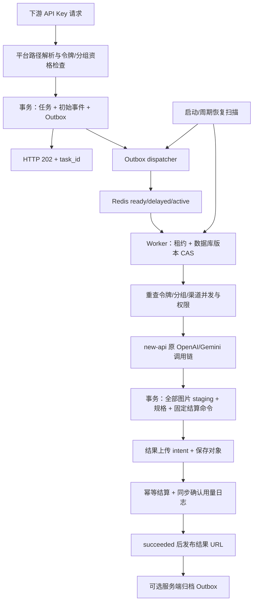

# new-api 图片功能迁移开发总纲

> 交付日期：2026-09-16。用途：把 Sub2API Fork 当前图片能力重新实现在 new-api 网关。本文与同目录三份配套文档组成可独立转交的开发包；复制这四份文件到目标仓库根目录即可开始开发。本文描述产品和实现要求，不表示 new-api 已经具备这些功能。

## 1. 阅读入口与交付范围

| 文件 | 内容 |
|---|---|
| [newapi图片功能Codex开发任务书.md](newapi图片功能Codex开发任务书.md) | 可直接交给 Codex 的完整开发指令、分阶段交付与完成判定 |
| 本文 | 源码基线、目标项目适配、持久化任务架构、数据模型、结算、调度、存储与验收 |
| [newapi异步生图API兼容规范.md](newapi异步生图API兼容规范.md) | 固定路径、BB/SC/OpenAI 请求与响应、参数转换、错误码与站内 API 文档规范 |
| [newapi图片页面与图库广场功能规格.md](newapi图片页面与图库广场功能规格.md) | 用户/管理员任务中心、工作台、本机个人图库、投稿审核、图片广场及站内业务接口 |

必须交付六项用户可见能力：站内异步生图 API 文档、用户异步生图任务、管理员生图任务中心、图片工作台、个人图库、图片广场。配套交付对象存储配置、投稿审核/举报、后台清理、可靠 Worker、计费幂等和权限隔离；缺少这些依赖，页面不能算完整实现。

目标是在 new-api 中直接调用其已有 OpenAI/Gemini 上游渠道，建立本地持久异步编排。**不是部署第二套 Sub2API，也不是只把请求代理给原站点。** 新任务需在 new-api 内形成任务、事件、结果和结算事实。

## 2. 本次实际核对的版本

### 2.1 来源仓库

| 项目 | 实际值 |
|---|---|
| 仓库 | `JasonWangJie/sub2api_forimg` |
| 本机路径 | `F:/Code/Git/sub2api_forimg` |
| 分支 | `main` |
| 完整 HEAD | `defccfacba610450ac5f9fd06e0f54c2f25fbb7a` |
| 提取前 status | `## main...origin/main`，工作树干净 |
| 提取前 describe | `v0.1.173.49-1-gdefccfa` |
| `backend/cmd/server/VERSION` | `0.1.173.49` |

资料生成后已复核来源工作树：三份记录修改、四份新增开发文档，`git describe=v0.1.173.49-1-gdefccfa-dirty`，HEAD和VERSION不变。上述 SHA 是被提取代码的基线，不是新文档的提交号；本轮未创建 Git 提交。

### 2.2 目标仓库只读核对

| 项目 | 实际值 |
|---|---|
| 本机路径 | `F:/Code/Git/new-api` |
| 完整 HEAD | `69a50029819a26c53e6babd276d49cfe2f8880ad` |
| status | `## main...origin/main`，工作树干净 |
| Go module / 版本 | `github.com/QuantumNous/new-api` / `go 1.25.1` |
| 后端 | Gin、GORM v2、Redis |
| 主数据库 | SQLite、MySQL、PostgreSQL，目标规则要求三者支持 |
| 前端 | React 19、TypeScript、Rsbuild 2、TanStack Router/Query/Table、Zustand、Base UI、Tailwind CSS 4 |
| 包管理与检查 | `bun.lock`；Bun；Vitest、`tsgo`、Oxlint |

只读核对没有修改目标仓库、运行其测试或启动服务。此路径用于本机参考；如果用户在另一份 new-api checkout 开发，Codex 必须重新读取实际 SHA、工作树、`AGENTS.md`、依赖和路由，不能把本快照当成目标当前状态。

## 3. 当前源码真值与旧文档纠偏

冲突时按“本次核对的源码/迁移 > 本开发包的兼容规范 > 历史专题/摘要”处理。以下结论尤其不能从旧摘要照抄：

| 问题 | 当前源码行为 |
|---|---|
| SC 查询是否使用 `pending/completed/failReason` | 否。当前 SC 和 BB 均返回 `queued/processing/succeeded/failed`、`task_id`、`data[].url`、`error_code`、`fail_reason` |
| SC 提交是否返回 `code/message/data` 包装 | 否。SC 与 OpenAI 均为 HTTP 202，直接返回 `task_id/query_url` |
| SC 请求错误是否需要另一种包装 | 当前 `writeProtocolError` 对 BB/SC 统一返回 `error.type/code/message` |
| 结果 URL 是否固定 24 小时 | 否。当前私有签名默认 3600 秒，公开 CDN 可返回稳定地址；输入默认保留 24 小时，任务/结果默认 90 天 |
| Gemini `auto` 是否必须有参考图 | 当前公共 BB/SC 文生图与图生图均允许 `auto/自动`，通过省略上游比例实现 |
| 个人图库是否自动显示异步结果 | 否。用户个人图库只展示本机 IndexedDB 的实时结果；异步成功结果仅本次预览并通过任务中心保留 |
| 异步是否默认自动服务端归档 | 否。`auto_archive_to_library=false`；开启后仅创建服务端图库引用，不改变用户本机图库规则 |
| 上游参考图拉取失败是否固定只重试一次 | 否。已有同账号两次重试、再换账号一次的持久历史判定；详见第 8 节 |
| 超时是否直接重跑 | 否。可能到达上游的超时/中断进入不确定结果，禁止自动再次生图 |
| 有历史对象是否禁止切换存储 | 当前保存路径允许即时切换；历史多凭证 resolver 尚未完整实现，旧引用可能暂时不可达 |
| API Key 是否只能调用一个平台 | 否。映射配置可使一 Key 同时调用 OpenAI/Gemini 的新异步路径，非异步请求仍沿用主分组 |

实现时保留当前用户行为。任何改变，例如把个人图库改为云图库、自动公开异步结果、增加视频、把实时入口改成异步，均须作为新需求单独说明。

## 4. new-api 适配原则

### 4.1 术语映射

| 来源概念 | new-api 中的适配 |
|---|---|
| API Key / `api_key_id` | `model.Token` / Token ID；站内展示可继续叫 API Key |
| User | 目标已有用户及登录会话 |
| Group 的数字 ID、平台和生图开关 | new-api 现有分组键为字符串；新增图片分组策略，引用其原分组字符串 |
| 上游 Account | `model.Channel`；任务页面文案用“最终渠道”，保存渠道 ID/名称与尝试记录 |
| 原模型映射 | 渠道模型映射、令牌模型权限、既有模型目录与实际协议适配器 |
| 余额/订阅/用量 | 目标既有 quota、wallet/subscription、日志与价格体系 |
| Sub2API SQL migration / Ent | 目标 GORM 模型和迁移机制；不要复制 Ent 与 PostgreSQL 专有 SQL |
| Vue 页面 | 在 `web/src/features/` 与文件路由中重写为 React 业务组件 |

`api_key_id` 等展示 DTO 可作为兼容字段映射 Token ID。**目标分组不得伪造数字 `group_id`**：站内新接口以 `group` 字符串为真值，必要时额外返回展示名称；不影响固定 `/v1` 公共协议，因为公共响应没有 group ID。双平台映射表按 Token ID + 平台保存目标分组字符串。

### 4.2 已有代码可复用的入口

以下为目标快照中实际存在的文件，开始编码前再次检查：

| 入口 | 适配用途 |
|---|---|
| `router/relay-router.go` | `TokenAuth` 与同步 Images/Gemini 入口；新提交路由单独鉴权，Worker 阶段再选择渠道 |
| `router/api-router.go` | 登录用户、管理 API、现有 `/api/task/self` 与 `/api/task` |
| `router/task-router.go` | 通用 `/v1/tasks/:key` 插件提交/读取；新固定图片路径需保持独立 |
| `model/token.go`、`model/channel.go`、`model/main.go` | 所有权、令牌/渠道查询、迁移注册、三数据库初始化 |
| `relay/image_handler.go`、`relay/channel/openai/relay_image.go` | 原生图片请求转换、上游执行与用量提取 |
| `service/image_billing.go`、`relay/request_billing.go` | 已有图片价格计算、请求计费输入 |
| `service/billing_session.go`、`service/task_billing.go` | 预扣/结算/退款生命周期；提取可复用逻辑，增加持久账务层 |
| `service/task_polling.go`、`model/task.go` | 已有第三方异步任务和轮询；不能无条件把新状态混入旧状态机 |
| `service/task_artifact_store.go`、`service/task_artifact_access.go` | 产物存储/访问边界；当前 store 仅禁用实现，必须补具体存储 |
| `service/authz/` | 权限资源、管理员能力与服务端授权 |
| `web/src/features/usage-logs/` | 已有任务详情、结果预览和任务日志组件，复用通用交互 |
| `web/src/components/data-table/`、`dialog.tsx`、`confirm-dialog.tsx`、`copy-button.tsx` | 表格、分页、弹窗、危险确认、复制 |

目标已有通用 `Task` 使用 `NOT_START/QUEUED/IN_PROGRESS/SUCCESS/FAILURE/UNKNOWN` 等状态，面向第三方任务及插件。不应直接改全局常量以承载本开发包的存储/账务阶段。建议新增 `AsyncImageTask` 及关联表，复用共用执行与展示组件；如采用通用 Task 扩展方案，先证明它能独立持久化后处理状态、版本锁、请求/结果、不可变账单，且不影响视频、Midjourney、插件和旧任务退款。

不要让 `middleware.Distribute()` 在用户提交阶段就替异步任务占用渠道并发槽位或触发上游调用。提交负责持久化受理；渠道调度、资格复查和生图并发在 Worker 真正调用前执行。

## 5. 服务架构与可靠性



主数据库是任务事实来源。Redis 是可重建投递层，不能以队列是否还有 key 判定任务是否存在或已经结算。用户关闭网页、断网、停止轮询都不取消已受理任务。

### 5.1 状态和展示

| 内部状态 | 公共状态 | 能否再次调用上游 |
|---|---|---|
| `queued` | `queued` | 首次执行或已经明确确认未生成的受控重试可以 |
| `invoking` 且未落库最终渠道 | `queued` | 只有唯一抢占者可执行；重复投递不可调用 |
| `invoking` 且已落库最终渠道 | `processing` | 不因租约重投再次调用 |
| `upstream_succeeded` | `processing` | 否 |
| `uploading` | `processing` | 否，只续跑存储 |
| `billing_pending` | `processing` | 否，只续跑结算/日志 |
| `succeeded` 且账务确认 | `succeeded` | 否 |
| `storage_failed` / `billing_failed` | 预算未耗尽为 `processing`，耗尽为 `failed` | 否，只后处理 |
| `execution_unknown` | `failed`，一般 608 | 禁止 |
| `failed` / `expired` | `failed` | 否 |

站内任务中心显示上述较细的内部阶段，但同样将“invoking + 无渠道”渲染为 queued。状态筛选也必须采用相同规则。任何重试回到 queued 时清空当前渠道，不清空历史尝试。

### 5.2 多实例、租约与崩溃边界

1. 创建 task/event/outbox 同事务；dispatcher claim token 防止过期 dispatcher 覆盖新认领；允许重复入队，由执行 CAS 去重。
2. `UPDATE ... WHERE task_id=? AND version=? AND status=?` 抢占 `queued -> invoking`，版本递增。只有更新成功的一方拥有本次调用权。
3. Redis 每次 Reserve 单独生成 lease token；Heartbeat/Ack/Requeue 校验 token。不能让旧 Worker 确认或删除新 Worker 的投递。
4. 调用期约每 15 秒心跳；数据库心跳仍新鲜时，Redis 租约失效的后到 Worker只观察，不把任务改成未知或重新调用。
5. 唯一调用者在 Redis token 丢失时可继续当前上游调用和数据库心跳；存储/结算后处理失去执行租约则停止，交给新执行者幂等续跑。
6. 已发出上游请求但未持久化 staging/账单的中断转 `execution_unknown`。上游没有可靠幂等保证，不能声称 exactly-once 上游执行。
7. 终态落库使用独立短超时 context，避免上游 context 取消后写库也被取消。
8. 执行超时按 `started_at`（缺省 `created_at`）墙钟时间判断，不只看 `updated_at`。超时仍可能产生上游结果时按未知结果处理并记录 `reconciliation_status=pending`。
9. 上传/结算预算独立。扫描 SQL/ORM 过滤耗尽预算的失败任务，稳定排序、有索引、批次上限。
10. 所有后台服务注册停止/等待退出；外部存储/上游调用不在长数据库事务中执行。

请求加密使用稳定服务端密钥材料，所有实例和重启后必须能解密活动任务；配置缺失时新提交503，不静默改成明文或临时随机key。密钥只在受控配置/密钥系统中，终态清完整载荷；轮换必须保留活动任务解密能力。不要直接套用来源TOTP密钥名称到目标认证配置。

## 6. 数据结构与三数据库实现

以下是逻辑模型，字段名称可适配目标风格，业务语义和约束必须保留。这里不提供可直接套用的 PostgreSQL DDL。

| 表/实体 | 必需内容与约束 |
|---|---|
| 图片分组策略 | 原分组字符串、图片平台/可用协议、生图与异步开关、图片池模式、模型目录；无配置时保持原有网关权限，不意外禁用同步 |
| Token 图片平台映射 | 唯一 `(token_id, platform)`，platform 仅 openai/gemini，目标 group 字符串 |
| AsyncImageTask | 不透明 `asyncimg_*` 唯一 ID；user/token/group；protocol/platform/kind/model/source_path；内部状态、version、进度；加密请求、请求 SHA-256；提示摘要、管理员参考 URL；当前渠道、尝试历史；请求/实际规格、实际图数；各类重试计数、时间、到期、错误、账务及对账状态 |
| 提交幂等记录 | 唯一 `(token_id, idempotency_key_hash)`；原键最多 255 字节，绑定 request_hash/task_id；未传幂等键不创建此记录 |
| AsyncImageResult | 唯一 `(task_id, image_index)`，**图片索引从 0 开始**；统一 storage object 引用、真实 MIME/字节/SHA-256/宽高 |
| AsyncImageStagingObject | task + image_index 的短期图片二进制和元数据；与固定账单原子保存；成功上传后及时释放 |
| AsyncImageResultUploadIntent | PUT 前固定 backend/provider/bucket/key/MIME/字节/checksum；状态、claim、时间；部分上传失败保留事实 |
| AsyncImageEvent | task、event_type、from/to_status、脱敏 message/payload、操作者、时间；原始内部状态用于管理员审计 |
| AsyncImageOutbox | topic/payload、available_at、attempts、claim_token/lease、published/error；创建及成功归档事件同事务写入 |
| 固定账单与执行账本 | task 唯一 billing_request_id/fingerprint；目标 quota 整数金额、来源/订阅、倍率与价格快照、实际用量、每个副作用的完成状态；日志 Outbox/幂等标识 |
| SC 上传 attempt | Token 的 60 秒滚动上传次数、admission 是否消费；无效 body 也计入 attempt |
| SC 上传 reservation | Token、上传请求哈希/幂等哈希、预留字节、处理 lease、确定性 object intent、输入对象、完成墓碑、删除次数/时间 |
| SC 输入对象/alias/引用 | Token 所有权、对象、到期；URL SHA-256 alias 及到期；task-input 活动引用；每对象最多 128 alias |
| ImageStorageObject | 稳定存储身份及 class=ephemeral/durable、MIME、字节、SHA-256、宽高、active/deleting/deleted、删除 claim；对象身份唯一 |
| ImageLibraryItem | 不透明 `img_*`、user、storage object、来源/任务/索引、模型/规格、私有标题/提示词、到期/软删除；异步来源唯一 `(user, task, image_index)` |
| ImagePublication | 不透明 `imgpub_*`、library item/user、状态、公开标题/可选提示词、share_prompt、审核/发布时间/到期、原因/操作者；活动投稿去重 |
| ImageSubmissionRequest | 不透明 `imgsub_*`、user、状态、checksum/byte_size/content_type/client_blob_key、模型与公开元数据、审核原因/时间、sync 后的 asset/publication |
| ImageReport | publication/reporter、固定 reason/details、open/resolved/dismissed、处理者/原因/时间；同用户同作品只能一条 open |
| LibraryEvent/Outbox | 归档/投稿/审核/撤回/删除审计与可靠外部副作用 |
| CleanupJob | scope、规范化 filters、claim/lease、进度/字节/错误；请求断开不丢任务 |
| LegacyMigrationState | 仅目标确实存在旧图片数据时建立；游标/claim、migrated/quarantined、错误 |

### 6.1 兼容策略

- 用 GORM 与目标现有 `lockForUpdate(tx)`；SQLite 不支持 `FOR UPDATE`，锁定退化为受控写事务 + CAS/唯一约束 + busy 重试。
- JSON 数组/快照采用目标公共 JSON wrapper 与跨数据库 Scanner/Valuer，必要时 TEXT 保存；禁止无回退 JSONB、`ILIKE`、`@>`、`SERIAL`、partial index、`SKIP LOCKED`。
- MySQL 5.7 没有 `SKIP LOCKED`，claim 用版本 CAS/lease token 的可移植实现；若优化分支采用专用语法，必须有 SQLite/MySQL 5.7 回退。
- 幂等键保留校验边界，索引使用固定 SHA-256 ASCII digest，避免 MySQL 复合索引长度及 collation 影响唯一语义；模型键按 UTF-8 字节校验，并确保区分大小写。
- 时间可内部保存 UTC Unix 毫秒/整数；HTTP DTO 转 RFC3339，上传 `created_at` 按协议返回 Unix 秒。平均耗时不要复制 `EXTRACT(EPOCH ...)`。
- 滚动 admission 按 Token 序列化写入。对用户图库条数/字节配额按用户锁定并计入未完成 intent，不能先查容量、再无保护上传造成多实例超卖。
- 批量外部 PUT/Delete 在事务外；事务只提交身份、引用、版本和执行意图。
- 表和索引迁移同时验证全新库、既有发布版升级库、连续两次启动迁移；不得改已有来源 SQL migration 的 checksum。
- 主库与日志库可以分离，甚至日志库使用 ClickHouse。扣费账本必须在主库原子保存，日志通过主库可靠事件 + 可验证幂等投影收敛；不能假设跨库事务。

## 7. 计费迁移：最大适配点

### 7.1 来源行为

来源没有新计价公式、没有提交时余额冻结。提交/调用前检查资格；上游成功后用原计费入口 Prepare 固定命令，再持久化图片 + 账单、上传、Apply、确认用量日志，最后成功。同任务重复 Apply 不重复扣费。图库/投稿/sync/查看不是新的生图费用。

### 7.2 目标现状与必需改造

目标 `BillingSession` 封装预扣、结算、退款，互斥和 settled 状态主要在内存；已有任务系统也有自己的预扣/差额结算上下文。不能把整个请求处理器丢进 goroutine，再靠内存 settled 标志声称崩溃可恢复。

新增持久异步结算适配器，复用目标已有价格/倍率/表达式计算和用量输入，持久化 **不可变实际 quota 命令**。推荐本功能维持来源的“新异步受理不预扣、上游明确成功后固定账单并结算”语义；目标现有同步/第三方任务的预扣逻辑保持原样。若目标执行链自动预扣，先拆出可捕获用量、可延后副作用的执行入口，不能直接把已有预扣函数调用一遍再执行新账单。

```text
资格检查（不改变余额）
  -> 渠道选择与上游明确成功
  -> 提取全部图片/真实尺寸/usage
  -> 调用 new-api 原价格计算，Prepare 实际 quota 命令
  -> staging + billing command 同事务
  -> 存储清单确认
  -> 主库账本 claim，幂等应用 wallet/subscription + Token + 渠道/用户计数
  -> 可靠写用量日志并确认
  -> succeeded
```

必须明确处理：资金来源成功但 Token 调整失败、扣费成功但日志失败、进程在扣费后状态写入前退出、Key 上游执行后软删除、后台改价、多实例同时 Apply。能同主库事务完成的 quota 副作用应与账本原子提交；Redis/批量缓存更新作为提交后的幂等刷新/失效，不能绕过持久账本重复减余额。独立副作用必须有持久完成标识和幂等键，不能只靠 bool。

目标 quota 用整数/严格转换/溢出检查，展示金额由目标单位转换，不能把来源 float 美元直接写成 quota。`actual_cost` 为展示值，持久结算命令的 quota 才是财务真值。

任务账务标识可采用 `async-image:<task_id>` 并绑定 Token ID 和 command fingerprint；同标识不同 fingerprint 返回冲突，不覆盖。固定以后重试不重新查询价格或倍率、不重新 Prepare。

### 7.3 数量与规格

- 先提取所有图片，不能只取第一个 candidate/part/data 项；实际返回两张就保存并计费两张。
- 明确请求档位经别名转换时按该档位 × 实际张数；超宽 `1K + 21:9 -> 2384x1024` 不因展示宽度变成更高计费档。
- OpenAI 显式原生 `WxH` 是权威尺寸，必须与附带 resolution 相容；`size=auto` 按实际产物规格，不能用 companion resolution 降档。
- 无显式档位且混合输出 `1K 一张 + 4K 一张` 按各图求和，不用最大档 × 总数。
- Gemini 原生像素规格映射按短边与现有来源计费保持一致，OpenAI 原生按其尺寸规则。合法 `0.5K` 归最低 1K 档。
- 在目标图片计价结构中落实档位/数量/质量/模型用量，复用其 group ratio、模型定价、订阅与表达式；新增需要的图片配置，不另写相互分叉的 Worker 公式。

普通用户/公共 API 只有 `status=succeeded AND billing_status IN (succeeded,not_billable) AND results 已持久化` 才能得到 URL。目标没有来源 simple 模式时，不必新增全局 simple 模式；免费/不计费场景须沿用目标规则并记录 not_billable 和用量。

## 8. 调度、参考图与受控重试

### 8.1 双平台分组解析

路径确定平台：`_oa` 为 OpenAI，`_gm/_sc` 为 Gemini。Token 显式平台映射优先，否则使用主分组图片策略中允许的对应平台。提交锁定实际计费 group；Worker 调用前重新解析必须仍相同，避免 Key 换组或映射变更使用错误价格。

new-api 原分组不等于单平台：必须用图片策略/模型/渠道可执行能力确定可用平台，不能根据分组名字或渠道数字类型猜平台。新策略缺失时提供与既有同步行为相容的默认；异步开关默认关闭。显式映射失效时不能静默跨组重试。

### 8.2 生图渠道池

为等价调度支持 `resolution/model/model_resolution` 三套独立配置：

- `resolution`：group + 1K/2K/4K。
- `model`：group + 客户端精确模型 ID。
- `model_resolution`：group + 客户端精确模型 + 档位。
- 模式互斥，配置并存；切换/关闭生图不删除其他草稿和绑定。
- 必需维度缺失或精确键没有绑定才回默认渠道候选；精确键有绑定但过滤后全不可用时封闭失败，不能跨池或用 `CrossGroupRetry` 逃逸。
- 客户端模型去首尾空白、区分大小写、有效 UTF-8、最多 255 字节、不含控制字符和 `*`；上游映射不改变池键。
- 池内 priority 覆盖本次候选排序；同优先级复用目标可用负载/权重策略；不复制 OAuth 账号专属逻辑到普通渠道。
- 渠道状态、模型权限、限流、排除、平台、熔断等必须继续过滤，不能因为独立池绑定而越权。
- 生图去普通会话黏性；有 Gemini `thoughtSignature` 的同步路径若目标支持则保留其必要黏性。任务级同账号重试 pin 是另一件事。

管理输入可支持 `101, 102:1, 103:1`：无显式 priority 时按输入序号，同池去重，保存重载完整回显。目标若不实现实时负载/LRU，记录其实际可复用策略，不能声称来源算法已经照搬。

### 8.3 参考图传输

三模式 `passthrough`、`local`、`passthrough_fallback_local`。来源 OpenAI 默认混合，Gemini 默认透传。HTTPS 透传 Gemini `fileData.fileUri`；内联转 `inlineData`；local/混合回退由安全下载器读取并严格验证。

外部下载校验协议、DNS、每次重定向及实际连接 IP，拒绝回环/内网/link-local/保留地址、防 DNS rebinding；限制时间、字节、像素、重定向。已绑定 SC 输入直接读稳定对象并复验 checksum/所有权，不走公开 CDN URL 再下载。已知失效/其他 Token 的 URL alias 不得降级成普通外部地址。

### 8.4 重试分类

容量等待、明确可重试上游失败、参考图拉取、单渠道尝试超时、存储、结算分别记次数与事件，受各自/总预算约束；可能已生成而结果未知时任何通用重试都不得重新调用。

来源对 `image_url fetch failed` 的账号历史默认约束是 **A 初始、A 重试 1、A 重试 2、B 重试 1；B 再失败终止**。本次失败尝试需先并入持久历史再判定下一次；任务 pin 不依赖 Redis 普通 sticky 缓存。同账号阶段不能被通用 failover 提前改成 B/C。混合传输可按来源策略回退本地读取，必须保留其阶段、预算和已发出请求判定；不能把 A/A/A/B 无条件套给所有网络错误。

同步/异步图片熔断 scope 隔离，默认关闭、连续失败阈值 5、冷却 300 秒，成功清零。精确渠道池过滤为零时仍封闭失败。后台生图并发闸门与 Worker 数独立：系统设置优先，运行时快照与 Redis 通知热更新，新请求使用新值；已经排队/执行不被中断。来源 Worker 数在启动时确定，改配置需重启且没有代码 64 上限。

## 9. 对象存储、归档与清理

### 9.1 两类存储

`image_storage` 用于异步结果/SC 输入；`image_durable_storage` 用于实时图手动导入、投稿 sync 和广场持久资产。durable 不得悄悄回落短生命周期桶。本机默认可用；多实例须共享盘或 OSS，单实例本机盘不能声称多实例一致可读。

来源异步存储还支持 local/superbed/oss（qiniu/aliyun/tencent/custom_s3）。目标至少完成本机和 S3 兼容 OSS；厂商预设可共享 S3 实现。Superbed 若追求存储选项全面等价需补厂商适配器，否则明确标记为尚未实现，不影响六项页面核心验收但影响供应商等价声明。

稳定 ObjectRef 包含 backend/provider/bucket/key/MIME/字节/checksum/宽高，数据库不存临时签名 URL。结果日目录 `results/YYYY/MM/DD/`，UTC submitted_at，文件名 `yyyyMMddHHmmss+GUID.ext`，GUID 从 task ID + 0-based 图片序号稳定生成；不要每次 retry 生成新 key 或任务子目录。实际可带统一配置前缀。

### 9.2 写入恢复与访问

- 上传前固定 intent；Save/HEAD 返回身份和 checksum 必须匹配，不接受对象被写到另一桶/key。
- 整批结果登记、统一对象引用和 intent 删除同事务；部分 PUT 成功保留整批意图直到收敛。
- 私有站内查看统一鉴权后动态签名/本机流式，`private,no-store`；URL 过期重新解析稳定 view URL。
- 广场 content 每次复核 published/未撤回/隐藏/未过期；本机公开流式短缓存一小时，OSS 重定向至多 300 秒且不超过签名剩余有效期。下架后可能存在短缓存窗口，应在运维说明中如实注明。
- 公开 CDN 地址意味着知道 URL 即可能读字节；应用“默认私有”不能覆盖一个公开存储桶的访问策略。需要私有字节保护时使用私有桶或签名访问；本机不能把私有图库目录直接暴露为无鉴权静态目录。
- 存储连接测试必须 PUT、HEAD/读、Delete，全部成功才报告可用；测试对象失败也要记录回收意图。

### 9.3 引用清理

软删除图库/撤回/过期通过 Outbox/cleanup job 执行，不直接删文件。删除前复核任何未删除图库引用、未过期 pending_review/published/admin_hidden 投稿引用、任何任务结果引用（兼容旧身份匹配）及活动输入任务引用。

对象 `active -> deleting -> deleted`，CAS claim/lease，外部 Delete 成功后标记 deleted；状态落库失败可幂等重做。结果过期不能误删图库/广场仍引用对象；图库删除也不能误删任务结果。临时结果桶的云厂商生命周期会绕过应用引用，因此跨长期用途必须转存 durable，或保证桶生命周期覆盖全部有效引用，不能只增加数据库引用就承诺永久图片。

清理支持 expired/deleted/user/async_results/all；先预览条目/字节再创建持久 job，UI 看数据库进度。维护循环可按来源约 10 秒、lease stale 120 秒、heartbeat 30 秒、清理 batch 100、旧数据迁移 batch 50 实现。

来源当前允许切换存储但没有完整历史凭证 resolver。目标建议保存可追踪的 storage profile 身份并明确历史解析能力；首版若只支持当前配置，就在后台说明旧图不可达可能性并提供预览/迁移/清理。不能写成当前源码禁止切换，也不能自动清空旧数据。

### 9.4 自动归档

默认不自动建图库记录。开启后 succeeded 转换与 library_archive Outbox 同事务；按 `(user,task,index)` 幂等建立引用，不复制字节、不再次计费；临时失败重排，权限/状态/校验永久错误终止。开启时可补缺历史成功事件，关闭时不补历史且旧事件标记跳过。此配置不改变本机个人图库只收实时图片的产品规则。

## 10. 默认运行参数（源码快照）

目标命名可适配 option/settings，保存为原子配置快照。下列值来自来源 `defaultAsyncImageRuntimeConfig()`；不是目标当前已配置值。

| 参数 | 默认 |
|---|---:|
| auto_archive_to_library | false |
| worker_concurrency / worker_lease_seconds / recovery_interval_seconds | 4 / 120 / 30 |
| execution_timeout_seconds / account_attempt_timeout_seconds | 1200 / 300 |
| storage_retry_attempts / billing_retry_attempts / retry_backoff_seconds | 5 / 10 / 30 |
| openai_reference_transport_mode | passthrough_fallback_local |
| gemini_reference_transport_mode / gemini_async_max_account_switches | passthrough / 3 |
| image_circuit_breaker_enabled / failure_threshold / cooldown_seconds | false / 5 / 300 |
| reference_fetch_max_retries / retry_base_seconds / retry_max_seconds | 2 / 15 / 60 |
| upstream_transient_max_retries / retry_base_seconds / retry_max_seconds | 3 / 15 / 60 |
| capacity_max_retries / retry_base_seconds / retry_max_seconds | 5 / 30 / 300 |
| total_max_retries / retry_jitter_percent / retry_after_max_seconds | 16 / 20 / 900 |
| download_max_bytes / download_max_pixels | 32 MiB / 80,000,000 |
| max_reference_images / max_reference_total_bytes / max_reference_total_pixels | 8 / 64 MiB / 80,000,000 |
| download_timeout_seconds / download_max_redirects / reference_fetch_concurrency | 30 / 3 / 8 |
| reference_cache_ttl_seconds / reference_cache_max_bytes | 60 / 128 MiB |
| upload_timeout_seconds / upload_per_minute / max_input_bytes_per_key | 300 / 20 / 1 GiB |
| signed_url_expiry_seconds / input_retention_hours | 3600 / 24 |
| task_retention_days / result_retention_days | 90 / 90 |
| prompt_preview_enabled / prompt_preview_max_chars | true / 160 |

服务端图库默认：90 天、1000 项/用户、5 GiB/用户、20 MiB/单图、40,000,000 像素、签名 3600 秒、导入 20 次/分钟、投稿 10 次/分钟。本机个人图库配额不同，见页面规格。

## 11. 开发与验收矩阵

| 阶段 | 必需交付与判定 |
|---|---|
| A 基础设施 | 目标实际基线、权限接入方案、三 DB 模型/迁移、ephemeral/durable 存储、固定结算适配；证明不会双扣 |
| B 公共异步链 | 全部固定路径、参数解析、幂等、上传 admission、Worker/outbox/lease、staging/intent、统一查询/601–613 |
| C 两个任务中心 | 用户隔离、管理员渠道审计、统计/分页/时间筛选、查看、resume/terminate/当前页批量结束 |
| D 工作台与个人图库 | 能力驱动模式、提交前复核、无跨模式回退、实时本机 Blob、异步追踪、上传/模型级参数 |
| E 广场与治理 | 延期投稿、审核、checksum sync、资产投稿、公开状态、举报/下架、维护 job/引用删除 |
| F 文档与完整验收 | 中英文站内 API 文档、可复制合法示例、路由/导航/权限/响应式、运行手册、测试证据与待验证项 |

重点自动化用例：

1. 相同 Token/幂等 key/原始请求并发提交只建一个 task，不同原始字节/路径 409；未带 key 建不同任务；不同 Token 隔离。
2. 三平台方言全路径 HTTP/JSON/header 完全匹配；同步 Images/Chat 和已有 task/plugin/video 行为不变。
3. 同用户其他 Token 查询公共任务 404；站内用户可看本人全部 Token；跨用户任务/输入/资产/submission 404；普通用户操作管理员 API 被拒绝；敏感字段只管理员详情。
4. Redis flush/重复投递/旧 lease Ack/dispatcher 延迟均不重复调用；调用结果未持久化崩溃进入 unknown；staging 后崩溃只后处理。
5. 调用 context 超时后仍可写终态；持续心跳不导致无限 invoking；晚到结果不覆盖管理员终态。
6. 钱包/订阅/Token/渠道用量/日志的每个故障窗口重试不双扣；固定账单后改价不变；deleted Token 只供结算读取。
7. 多图/混合尺寸/显式档位/原生 WxH/auto/0.5K 正确存储和计费；实际 quota 溢出被拒绝。
8. SC 无效 body 计 attempt、多实例字节 reservation 不超卖、failed intent 不提前释放、same-key 重签、alias 128 上限/墓碑、迟到 PUT 二次删除。
9. 三种渠道池精确/缺配置回退/有池空候选封闭失败；模型别名不改池键；A/A/A/B 持久历史跨重启和无 sticky Redis仍成立。
10. 本机个人图库按用户隔离并执行 30 天/100 张/200 MiB；异步不入本机图库；刷新/卸载释放 object URL；用户清站点后 sync 缺图有可读状态。
11. share_prompt=false 的广场不返回 prompt；未发布/隐藏/过期 content 不可读；举报 open 去重；sync hash 不一致被拒绝、并发 sync 不重复发布。
12. 删除互相引用对象不误删，部分 PUT/孤儿意图/删除成功写库失败可收敛；清理预览 scope 与执行一致。

目标规则要求真实 SQLite/MySQL/PostgreSQL，以及新建/升级/重跑迁移。测试不足时明确写 PENDING 和具体环境缺口。mock/编译通过不能写成已验证三数据库、多实例或生产。

建议验证命令按目标实际工具执行：根 module 受影响 Go 测试、`go test ./...`、`go build ./...`；若改 relaykit，单独 `GOWORK=off go build ./...` 和对应测试；web 使用 `bun install --frozen-lockfile`、`bun run test`、`bun run typecheck`、`bun run lint`、`bun run build:check`。测试运行前确认配置只连接隔离环境。

本次仅生成文档及检查本地链接/差异，未执行上述代码或数据库验收，未修改/部署/重启 new-api 或生产。

## 12. 来源实现索引（可选复核资料）

四份开发包自包含下游契约和业务要求。以下来源路径帮助能访问本仓库的开发者核对实现，**不是要求目标仓库必须带这些文件**。

| 范围 | 来源相对路径 |
|---|---|
| 接口与站内指南 | `异步生图接口文档new.md`、`docs/DURABLE_ASYNC_IMAGE_API.md`、`frontend/src/views/user/{GuideAsyncImageApiView.vue,guideAsyncImageApiContent.ts,AsyncImageApiEndpointCard.vue}` |
| 公共受理/查询/上传/错误 | `backend/internal/handler/durable_async_image_handler.go` |
| Worker/用量捕获/保留 | `backend/internal/handler/{durable_async_image_worker.go,async_image_usage_capture.go,durable_async_image_retention.go}` |
| 状态/规范化/终止/恢复 | `backend/internal/service/{async_image_task.go,async_image_protocol.go,async_image_task_terminate.go,async_image_task_resume.go,async_image_account_attempt.go}` |
| 原生尺寸/账务 | `backend/internal/service/{openai_image_dimensions.go,image_billing_size.go,prepared_usage_billing.go}`、`backend/internal/repository/usage_billing_repo.go` |
| 任务持久化/队列/上传 | `backend/internal/repository/{async_image_task_repo.go,async_image_queue.go,async_image_upload_repo.go,async_image_result_upload_intent_repo.go}` |
| 任务中心 | `backend/internal/handler/async_image_task_center_handler.go`、`frontend/src/features/async-image-tasks/` |
| 能力/工作台 | `backend/internal/service/image_workbench.go`、`backend/internal/handler/image_workbench_handler.go`、`frontend/src/views/user/ImageWorkbenchView.vue`、`frontend/src/api/imageWorkbench.ts` |
| 本机图库/投稿 Blob | `frontend/src/features/image-workflow/{personalGalleryStore.ts,submissionBlobStore.ts,ImageLibraryPanel.vue}`、`frontend/src/views/user/ImageLibraryView.vue` |
| 图库/延期投稿/广场治理 | `backend/internal/service/{image_library.go,image_plaza_submission.go,image_library_maintenance.go}`、`backend/internal/handler/image_library_handler.go`、`backend/internal/repository/image_library_repo.go`、`frontend/src/api/imageLibrary.ts` |
| 广场/审核页面 | `frontend/src/views/user/ImagePlazaView.vue`、`frontend/src/views/admin/ImageModerationView.vue` |
| 存储/配置 | `backend/internal/service/{image_storage.go,image_storage_settings.go}`、`backend/internal/repository/image_storage_s3.go`、`deploy/config.example.yaml` |
| 路由 | `backend/internal/server/routes/{gateway.go,user.go,admin.go}` |
| 迁移 | `backend/migrations/185_ZJ_async_image_tasks.sql`、`186_ZJ_image_library_and_plaza_moderation.sql`、`187_ZJ_async_image_upload_reservations.sql`、`188_ZJ_plaza_submission_deferred_upload.sql`、`189_ZJ_async_image_result_upload_intents.sql`、`192_ZJ_image_library_upload_intents.sql`、`221_ZJ_api_key_platform_groups.sql`、`222_ZJ_group_image_size_accounts.sql`、`223_ZJ_async_image_reference_retry_state.sql`、`224_ZJ_async_image_account_attempts.sql`、`225_ZJ_image_account_pool_modes.sql`、`226_ZJ_async_image_reference_urls.sql` |

可选来源专题路径：`wiki-new/异步生图架构.md`、`wiki-new/计费与幂等.md`、`wiki-new/图片工作台.md`、`wiki-new/图片图库与对象模型.md`、`wiki-new/图片广场审核与迁移.md`、`wiki-new/对象存储与保留策略.md`、`wiki-new/生图账号池多维调度.md`。它们只在来源仓库可用，复制开发包到目标后无需依赖；四份文件的可点击配套链接均仅引用本开发包。
