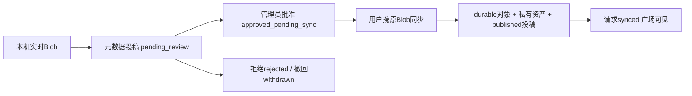

# new-api 图片页面与图库广场功能规格

> 本文提取 Sub2API Fork `defccfacba610450ac5f9fd06e0f54c2f25fbb7a` 当前产品行为，供 new-api React 前端及站内后端开发。生成日期 2026-09-16。配套：[开发总纲](newapi图片功能迁移开发总纲.md)、[公共API规范](newapi异步生图API兼容规范.md)、[Codex任务书](newapi图片功能Codex开发任务书.md)。

## 1. 页面与权限总表

以下是来源页面的语义和建议目标页面。new-api使用其文件路由/统一登录布局注册，实际console路径按目标惯例确定并记录，不强行改现有路由。

| 页面 | 来源路径/语义 | 权限与内容 |
|---|---|---|
| 异步生图API指南 | 用户指南入口 | 站内完整中英文文档、端点卡片、目录与示例复制 |
| 用户异步生图任务 | `/async-image-tasks` | 本人全部Token的持久任务、筛选/统计、详情/结果 |
| 管理员生图任务中心 | `/admin/async-image-tasks` | 全站任务、用户/最终渠道、尝试/参考URL审计、后处理恢复、结束/批量结束 |
| 图片工作台 | `/image-workbench` | 选择本人Key→服务端能力决定实时/异步→生成/编辑→结果与任务追踪 |
| 个人图库 | `/image-library` | **本机实时生成图片**，不是云端任务结果列表 |
| 图片广场 | `/image-plaza` | 登录后作品列表、预览/公开提示词/同款/举报；published content可无登录访问 |
| 图片审核管理 | 管理端ImageModerationView | 已存图投稿审核、本机延期投稿、举报、全站存储/清理/迁移 |
| 生图设置 | 管理端系统设置 | 异步与durable存储、运行参数、图片分组策略/双平台映射/渠道池、并发与熔断 |

前端隐藏按钮不能代替服务端权限。站内功能复用new-api会话与Casbin资源；普通用户不能访问管理API。跨用户任务/Token能力/资产/投稿请求按404处理。

## 2. 用户异步任务中心

### 2.1 页面结构

- 标题“异步生图任务”，说明任务受理后服务端继续执行。
- 顶部统计：进行中、已完成、失败、成功率、平均耗时。
- 来源可见筛选：关键词、状态、平台、文生图/图生图、存储供应商、起止日期；后端另支持Token、分组、模型、协议/账务等精确参数。目标可将这些服务端参数接入“更多筛选”，但不能写成源页面已经全部展示。
- 默认日期为浏览器本地当天start/end，不是自动近7天或UTC当天。后台按传入timezone转换到UTC，end_date包含当天。
- 列表：任务号/复制、提交时间、平台、模型、状态、结果摘要/预览、费用、耗时、操作；行内容紧凑，提示词不放成占大量宽度的长列。
- 服务端分页与排序，默认created_at desc，page_size至多100；切换筛选回第一页，避免旧请求覆盖新筛选结果。
- 手动刷新、可选自动刷新，来源档位5/10/30/60秒、默认10秒，用户/管理员偏好分开保存；不把轮询错误解释为任务失败。

任务号完整可复制，桌面加宽。**行点击和任务号点击都不打开详情，只允许“查看”按钮。** 图标按钮有tooltip和aria-label。

### 2.2 详情

显示任务号、状态/进度、平台/协议/类型、模型、脱敏提示摘要、请求/实际规格、比例、张数、费用/账务状态、存储供应商、重试次数、提交/开始/结束/到期时间、事件时间线。成功且结算确认才显示结果，支持灯箱、下载/打开与动态view URL解析。

用户不显示最终渠道ID/名称、渠道尝试、上游request ID、管理员参考图URL、内部bucket/key或账单。用户没有resume/terminate/批量结束。事件message使用用户脱敏视图，原始内部to_status不能直接渲染为公共状态。

空态、加载、查询错误均有明确反馈。已过期结果提示过期，不触发重新生成。关闭详情/停止刷新不会结束服务端任务。

### 2.3 统计口径

统计针对当前完整筛选集合，**不从当前页计算**：

```text
active = queued + invoking + upstream_succeeded + uploading + billing_pending
completed = succeeded
failed = failed + execution_unknown + storage_failed + billing_failed + expired
success_rate = completed / (completed + failed) * 100，无样本为0
average_duration_ms = AVG(finished_at - submitted_at)，仅succeeded且finished_at存在
```

平均无样本为null，前端显示“-”，不是0毫秒。该平均包含排队和后处理时间。来源列表展示实时进行耗时时使用started_at（无则submitted_at）至当前时间，终态也有服务端duration_ms字段；目标统一格式并清楚区分执行显示与统计口径，不把“平均耗时”改成纯上游响应耗时。

来源将storage_failed/billing_failed纳入failed统计，即使它们仍可能后处理重试；这是当前口径。不要偷偷改成所有仍可恢复都计active。

## 3. 管理员生图任务中心

复用同一任务业务组件，admin scope提供不同列、筛选和操作，后端独立受保护接口。

### 3.1 管理视图

- 全站查询，可筛用户、Token、计费分组、最终渠道、状态/平台/模型/存储/日期/协议。
- q匹配task ID、模型、提示摘要、最终渠道名称/ID的大小写不敏感模糊搜索；目标执行大小写兼容SQL，不复制PostgreSQL ILIKE。
- 用户列只显示邮箱/目标可用标识，来源宽约160px；最终渠道列约200px，显示名称和ID；任务号约220px。宽度可按目标表格主题调整，保留清楚的诊断信息。
- 当前无最终渠道显示未分配；invoking且未分配同时显示queued，筛选口径相同。
- 详情增加用户/Token/分组、最终渠道、上游request ID、尝试次数/去重渠道ID/每次尝试、最近失败、对账状态、管理操作。
- 每次attempt保存channel ID/name、状态、HTTP status、脱敏错误、上游request ID、attempted_at；历史不因queued重试清空。

新任务reference_image_urls仅管理员**详情**加载，在提示词下逐条展示完整链接，顺序/重复保留。前端再次只允许HTTP(S)，`target=_blank`、`rel=noopener noreferrer`。历史空列表不回填，签名链接过期显示为自然时效问题，不能称数据丢失。不要把此字段加到共享列表DTO。

### 3.2 恢复后处理

仅storage_failed/billing_failed可以resume，服务端再次验证状态、版本、剩余数据及租约，重新投递后处理并记审计。按钮文案“恢复后处理”或清楚标注只存储/结算；不调用上游、不重新Prepare、不改既定价格。execution_unknown/普通failed/succeeded/expired不能resume。

### 3.3 手动结束

可结束：queued、invoking、upstream_succeeded、uploading、billing_pending、execution_unknown、storage_failed、billing_failed。成功/普通失败/过期不可再次结束。

危险确认展示task ID与影响。结束以status+version CAS标failed、内部error_code=admin_terminated、finished_at、清加密请求、事件admin_task_terminated。记录管理员操作者，late worker不能覆盖。结束不承诺撤销已发出上游请求、不自动退款、不删除仍有引用图片；这些是独立财务/存储操作。

### 3.4 “结束当前页”

按钮“结束当前页（N）”，N为当前已加载页的可结束任务数。点击冻结ID快照，一次确认后提交，不维护跨页选择，也不按查询条件终止全站任务。

body最多100个task ID，原输入长度超100先拒绝，trim去重按输入顺序；空项拒绝。逐项复用单任务CAS，结果terminated/skipped/failed；任务已经完成或CAS冲突skipped，缺失等其他错误failed。requested为去重后数。

HTTP200只表示批量请求处理完，必须读计数/逐项结果：

```json
{
  "requested": 3,
  "terminated": 1,
  "skipped": 1,
  "failed": 1,
  "items": [
    {"task_id":"asyncimg_a","status":"terminated"},
    {"task_id":"asyncimg_b","status":"skipped","message":"task is already final"},
    {"task_id":"asyncimg_c","status":"failed","message":"task not found"}
  ]
}
```

完成反馈并刷新当前页/统计；整个请求失败保留快照/确认结果供重试或取消。用户页不显示或调用。

## 4. 任务中心站内 API

来源前缀为`/api/v1`；目标管理API一般`/api`。建议在目标复用`/api`统一前缀，文档、前端和路由同步；若用户要求站内也URL完全兼容则增加受同权限保护的`/api/v1`别名。**固定公共`/v1`协议不得随此前缀适配改变。**

下列路径均相对于目标管理API根，data表示经过目标已有成功包装后的业务DTO；公共异步响应不套站内wrapper。

| 方法/路径 | 权限与行为 |
|---|---|
| GET /user/async-image-tasks | 用户，服务端强制user_id=当前用户 |
| GET /user/async-image-tasks/{task_id} | 本人详情 |
| GET /user/async-image-tasks/{task_id}/results/{image_index}/view | 本人成功/结算结果，0-based index |
| GET /admin/async-image-tasks | 管理员全站分页/统计 |
| GET /admin/async-image-tasks/{task_id} | 管理员详情与专属审计 |
| GET /admin/async-image-tasks/{task_id}/results/{image_index}/view | 管理员诊断查看，按运维权限限制 |
| POST /admin/async-image-tasks/{task_id}/resume | 后处理恢复 |
| POST /admin/async-image-tasks/{task_id}/terminate | CAS结束 |
| POST /admin/async-image-tasks/batch-terminate | body={task_ids:[...]}，当前页批量 |

列表参数：page/page_size、q、task_id、status、protocol、platform、request_type、billing_status、model、api_key_id（Token别名）、group（目标字符串）、account_id或channel_id（管理过滤）、user_id（管理）、storage_provider、start_date/end_date=YYYY-MM-DD、timezone、sort_by/sort_order。用户请求渠道筛选应拒绝。排序字段服务端白名单，不拼接用户SQL。

列表data：`{items,total,page,page_size,pages,stats}`；详情data：`{task,results,events}`。task共有字段：id/task_id、protocol/platform/request_type/model/status/billing_status/progress、requested_size/actual_size/aspect_ratio、image_count/result_count、实际费用/currency、prompt_summary、retry_count、内部error_code/error_message、can_resume/can_terminate、duration_ms、各时间。管理专属见第3节。

结果项：id、image_index/index、provider、content_type、byte_size/size_bytes、checksum、width/height、url/preview_url/view_url、expires_at、created_at。不返回bucket/object_key。事件：id、event_type、status、from/to_status（按权限）、message、created_at。稳定view接口Accept:application/json得到`{url,expires_at}`，否则本机200流式或307动态跳转。

## 5. 图片工作台

### 5.1 能力决定模式

用户不能手选实时/异步。选择自己的Token后请求能力快照；分组图片策略决定模式，提交前再次获取并比较capability_version。变化时更新合法参数、停止本次提交，提示重新确认；不得已经发出生成再告知变化。

| 能力平台/开关 | 模式/协议 | 唯一提交链 |
|---|---|---|
| OpenAI，异步关闭 | realtime/openai_images | 原images/generations或edits |
| OpenAI，异步开启/映射 | async/openai_async | generations_oa，带参考图自动编辑；edits_oa也可明确编辑 |
| Gemini，异步关闭 | realtime/gemini_native | 原generateContent，参考图inlineData |
| Gemini，异步开启/映射 | async/gemini_sc | 必要时SC file上传→generations_sc |
| Grok | realtime/grok_images | 目标确实支持的原生图片链 |
| 不支持的平台/无图片模型/Key失效/存储不可用 | unavailable | 禁止提交，说明原因 |

来源不支持无映射Antigravity等工作台Key；目标不要仅按“有任何渠道”就承诺该协议可用。双平台异步Token可合并可用模型/入口；目标必须把每个可选模型对应平台/协议分清，不能让用户选Gemini模型后发OpenAI参数。

能力接口：`GET /user/image-workbench/capabilities/{api_key_id}`，站内登录，跨用户404。返回字段：

```text
capability_version（规范化能力SHA摘要，含影响行为的配置/模型变化）
api_key_id（Token ID）、group（目标字符串）、platform
available/unavailable_reason、execution_mode/protocol
models:[{id,label,qualities?}]、endpoints:{generation,edit,upload,query}
supports_reference_images、max_output_images、max_reference_images
image_sizes、aspect_ratios、qualities、formats、backgrounds
```

示例默认不能把整个目标模型目录全部当图片模型。能力与令牌权限/渠道映射/分组目录一致；允许管理员精确手动增加模型，保存后刷新能力可见，实际可执行仍需渠道支持。

### 5.2 布局与表单

桌面三栏：Key/平台/模式和参考图；提示词/参数/结果；任务摘要和个人图库。平板两栏，手机单列并取消嵌套滚动。

表单支持提示词、参考图上传/顺序/移除/数量与体积校验、当前平台/模型合法参数、提交按钮。实时/异步图标、标题、按钮和状态结构有区别，不仅颜色不同。

OpenAI：原生size/quality/output_format/background/n，必要时分组兼容档位/比例；选择模型级qualities覆盖平台默认。来源2.5两模型质量auto/low/medium/high/xhigh/max，旧模型不显示扩展值。编辑保留output_format等参数。

Gemini：只用能力支持resolution/ratio，工作台单次输出能力1；服务端仍接收和计费全部实际输出。实时图生图inlineData，异步SC image_urls。不显示OpenAI背景/质量/批量选项；auto obey当前API规范。

Grok仅显示目标真实支持参数/实时链，异步开关不能把其改成Gemini/OpenAI异步。

### 5.3 提交与追踪

1. 选择Key、加载能力，移除不再合法参数和参考图数量。
2. 提交前复核能力；同版本才创建操作快照。
3. 实时走原同步调用，显示连接/生成/结果；不自动切异步。
4. 异步每次用户生成操作创建一个Idempotency-Key和不可变body，multipart首次序列化缓存boundary；上传参考图与最终生成是不同操作。
5. 受理后显示task ID/阶段/任务中心入口，关闭页面不取消task。
6. 查询失败只反馈查询问题和退避继续，不重复生成。来源工作台使用首次约1.2秒、常规2.5秒、失败5秒；目标建议按协议Retry-After>=3秒调整，属于轮询节奏优化，须明确实现值。
7. 允许“继续添加”解除表单占用继续新任务，原任务服务端继续；如前端只追踪一个活动任务，须避免旧poll覆盖新结果并通过任务中心找回。
8. unknown提交显示“确认提交结果”并复用原请求/原key，不能静默生成新操作。任务execution_unknown禁止自动新提交。

403/409/超时/5xx/网络未知/存储失败/归档失败均不得实时异步互相回退，不跨平台换链。离开页面取消fetch/timer，服务器已有task继续。

### 5.4 结果保存

实时成功将图片转真实MIME Blob并写本机个人图库，默认不上传服务器/import/OSS。异步成功仅本次结果预览，**不写本机个人图库、不自动from-task**。结果生成/本机保存/手工归档错误分开显示，后两者失败不能重跑上游/重复计费。

结果支持预览/灯箱、下载、复用提示、显式投稿。不要通过生成成功副作用自动公开。异步归档仅服务器显式auto_archive开关或独立from-task行为，不能与本机个人图库混用。

## 6. 本机个人图库

### 6.1 存储真值

用户个人图库和工作台侧栏只显示当前用户本浏览器IndexedDB的实时图，保存Blob和元数据，不持久data URL或临时object URL。新站点命名空间使用new-api，避免同域下和原站混读。

默认每用户30天、最多100张、总量200MiB。先清过期，再按该用户最旧清理，任一超限触发。logout/切用户不能展示另一用户图；换设备/清站点数据会丢失，页面明确说明本机范围。

数据字段：随机local ID、user ID、created/expires_at、Blob/byteSize/MIME、模型/平台、请求/实际规格、提示词/私有标题、操作/归档key、投稿请求ID/状态、clientBlobKey。按需要保存生成Key ID元数据，不保存其可用明文Token。

创建`URL.createObjectURL(blob)`用于预览，记录删除/图片切换/页面卸载时revoke，浏览器存储不可用/额度满时给可读提示或短期内存回退，不能假装已持久保存。

### 6.2 页面操作

图库网格/紧凑侧栏、平台/模型/关键词筛选、本机时间排序、灯箱/下载、复制或复用提示、删除本机项、提交审核、等待审核/拒绝/待同步状态、审核通过同步。筛选与删除基于本机数据库，不调用服务端库列表伪装本机。

另有**投稿Blob存储**，来源90天、最多40条、总量400MiB，用于审核通过后找回字节，与个人图库30天/100张/200MiB不同。用户清本机图不应无提示删掉仍待审核投稿所需Blob；到期/Blob丢失时标“本机原图不可用”，可用原checksum一致文件恢复后sync，不能直接换一张未审核的图。

来源另有短期手工归档恢复记录24小时/20条/200MiB，非任务本机图库；可复用其用途，但异步task不加入“等待恢复归档”提示。不要把所有恢复队列合并成个人图库历史。

## 7. 投稿与服务器资产

### 7.1 本机延期投稿（默认实时图路径）



投稿前选择public_title和share_prompt（默认false），checksum客户端计算，服务端只保存元数据/请求哈希。审核前不上传原图，不占OSS。管理员本机投稿审核页**无原图预览**，说明图片仍在用户本机；批准只代表允许用户同步，批准≠published。

来源这条审核路径是元数据审核，不能宣称管理员已审查实际图片内容。目标可按同产品行为实现并明确文案；如果另加同步后图片内容复审，是扩展安全流程，需单独说明状态/显示变化，不能假装现版本已有。

sync只允许请求所有者、approved_pending_sync。服务端对上传字节byte_size/checksum与已批请求精确匹配，再做完整MIME/容器/像素校验，写durable存储，用sync:<request_id>幂等创建资产/投稿并标synced。来源按多步幂等写入收敛；目标建议事务/CAS+可靠intent确保跨步骤失败、并发sync和重试不双上传/双published。synced重复sync返回原关联结果。

使用FormData时让浏览器/Axios生成含boundary的Content-Type，不手工写`multipart/form-data`裸头。这里与为了**生成提交指纹**手动固定boundary的OpenAI异步multipart是两种用途，不能套错。

### 7.2 已服务器资产投稿

手工import或明确from-task创建的是私有服务器资产，可走publications：pending_review→管理员approve→published；reject→rejected；用户withdraw→withdrawn；管理员hide→admin_hidden；restore→published；到期expired。

pending_review/admin_hidden可作为活动引用保护图片，不能修改library.visibility绕过审核。提示词默认私有，share_prompt=true才公开，可提供明确public_prompt。来源from-task只建结果引用，不复制字节；长保留投稿须检查临时桶生命周期，目标需要持久资产时转durable。

## 8. 图库/延期投稿业务 API

路径相对于目标管理API根，登录用户，跨用户404；成功包装按目标既有格式。

| 方法/路径 | 请求与行为 |
|---|---|
| GET /user/image-library | 服务端资产游标列表，**不等于用户本机图库**；visibility/source_type/platform/status/q、cursor/limit |
| POST /user/image-library/import | multipart file，元数据见下；独立Idempotency-Key；返回{item,reused} |
| POST /user/image-library/import-url | JSON image_url +元数据，安全HTTPS下载；同幂等作用域 |
| POST /user/image-library/from-task | {task_id,image_index,title?}，index从0；本人的succeeded且billing确认结果；{item,reused} |
| GET/PATCH/DELETE /user/image-library/{asset_id} | 详情/私有title/private_prompt编辑/软删除；id=img_* |
| GET /user/image-library/{asset_id}/view | JSON URL或307/本机流式，private no-store |
| POST /user/image-library/{asset_id}/publications | {public_title,share_prompt,public_prompt?}，待审投稿 |
| DELETE /user/image-library/{asset_id}/publication | 撤回待审或有效投稿 |
| GET /user/image-library/submission-requests | 本人延期请求status/cursor/limit |
| POST /user/image-library/submission-requests | 下方元数据JSON+独立Idempotency-Key；新建{item,reused:false}，复用true |
| POST /user/image-library/submission-requests/{request_id}/sync | multipart file，按已批hash校验；返回{item,library_item} |
| DELETE /user/image-library/submission-requests/{request_id} | 撤回本人待审/待同步 |

import元数据：api_key_id（本人Token）、group（目标字符串、服务端核验）、platform、generation_mode=realtime/async/import、source_type=realtime_import/async_task/manual_import/legacy_plaza、model、requested_size/actual_size/aspect_ratio/quality、title、prompt。手工导入用户元数据不能作为财务事实。

延期投稿创建body：

```json
{
  "title": "本机作品",
  "private_prompt": "现代客厅，北欧风，自然光",
  "public_title": "自然光客厅",
  "share_prompt": false,
  "platform": "openai",
  "generation_mode": "realtime",
  "source_type": "realtime_import",
  "model": "gpt-image-2",
  "requested_size": "1024x1024",
  "aspect_ratio": "1:1",
  "quality": "high",
  "content_type": "image/png",
  "byte_size": 204800,
  "checksum_sha256": "0123456789abcdef0123456789abcdef0123456789abcdef0123456789abcdef",
  "client_blob_key": "local-blob-opaque-id"
}
```

示例hash/字节仅占位，真实用原Blob计算；private_prompt不等于public_prompt。来源创建body不含width/height，真实宽高在sync完整校验时得到；不能从旧专题误写为必填宽高。request返回imgsub_*、status、审核信息、clientBlobKey、可能的asset/publication、image_held_client_side。普通用户只读自己的请求数据，不公开这些元数据。

服务端图库游标使用(created_at,id)稳定排序，来源limit默认30/最多100；目标可按统一配置调整并记录，前端用next_cursor，不套任务中心offset分页。同user/key不同import元数据指纹409；from-task另有(user,task,index)唯一约束。

## 9. 图片广场

### 9.1 列表与预览

登录后GET作品列表，仅published、未撤回/隐藏/过期且资产有效；游标分页、平台/宽高比/搜索筛选、newest/oldest排序、加载更多、空态/错误/加载、图片网格及灯箱。来源前端每批9项，后端默认limit30/最多100。响应仅不透明投稿/资产ID、公开creator、is_owner、公开title、可选prompt、平台/model/规格/宽高/MIME、稳定image_url、发布时间/到期。

网格与灯箱使用同一稳定相对content URL，浏览器可复用短缓存，不IndexedDB另存整份广场原图。显示公开提示词/复制/同款功能仅当实际返回prompt；无共享提示词不提供暗中复用私人prompt。模型不可用于用户当前Key时切到工作台提示选择可用模型，不自动跨权限生成。

用户可举报已公开作品；自己的作品可按所有权撤回。不新增点赞/评论/收藏/视频/全量云同步，它们不属于当前提取范围。

| 方法/路径 | 行为 |
|---|---|
| GET /image-plaza | 登录列表；platform/model/aspect_ratio/q/sort/cursor/limit；sort仅newest/oldest |
| GET /image-plaza/{publication_id}/content | published状态复核，**允许无登录读已公开内容**；本机200流式或OSS307 |
| POST /image-plaza/{publication_id}/reports | 登录；{reason,details}；只公开作品 |

举报reason固定spam/sexual/violence/copyright/privacy/other；状态open/resolved/dismissed，同用户同作品最多一条open。举报不是自动删除OSS，管理员resolution与下架动作分别审计。

## 10. 图片审核与存储管理

后台页签：已存图投稿（图预览）、本机投稿（无图）、举报、全站资产与统计、清理任务/迁移。遵循目标已有表格/筛选/分页和权限布局。

| 方法/路径 | 行为 |
|---|---|
| GET /admin/image-plaza/publications | status/user/platform/q/cursor/limit |
| GET /admin/image-plaza/publications/{id}/view | 管理员审核预览 |
| POST /admin/image-plaza/publications/{id}/{action} | approve/reject/hide/restore，{reason}；reject/hide需非空原因 |
| POST /admin/image-plaza/publications/batch | publication_ids最多100、action、reason；源服务可复用四种动作，页面批量按钮为approve/reject，逐项结果 |
| GET /admin/image-plaza/submission-requests | 延期请求status/cursor/limit |
| POST /admin/image-plaza/submission-requests/{id}/{action} | approve→approved_pending_sync或reject，{reason} |
| GET /admin/image-plaza/reports | status/cursor/limit |
| POST /admin/image-plaza/reports/{report_id}/resolve | {status:"resolved"或"dismissed",resolution:"处理说明"}；不能把UI action resolve/dismiss直接发成状态 |
| GET /admin/image-library | 全站服务端资产/user/来源/platform/status/q/cursor/limit |
| GET /admin/image-library/stats | item_count/object_count/total_bytes/pending_review/published/open_reports |
| GET /admin/image-library/{asset_id}/view | 管理查看 |
| GET /admin/image-library/cleanup-jobs | 持久job列表 |
| POST /admin/image-library/cleanup-jobs/preview | {scope,filters}，返回matched_items/matched_bytes |
| POST /admin/image-library/cleanup-jobs | 同规范化scope/filters，创建后台清理job |
| GET /admin/image-library/migration | 仅有旧数据迁移时返回真实进度/隔离计数，无旧数据标不适用 |

动态action路由不吞静态batch；Gin同位置wildcard命名一致。批量审核复用单项状态机，返回逐项success/error与计数，不能HTTP200后都提示成功；本机投稿与已有资产的批量能力不要混淆。

清理scope=expired/deleted/user/async_results/all，先预览，再危险确认，后台job状态/进度/失败可刷新。不会因浏览器断开重复执行或丢失结果。不擅自把async_results清理等同删除全部图库/广场。

来源旧广场迁移：先隐藏未经审核公开内容，验证安全路径/完整容器、导入私有durable资产、建pending_review且不share_prompt，稳定legacy-ID幂等与游标；危险/损坏/丢失/越界quarantine，临时存储错误可恢复。目标没有旧广场表时不新增空迁移或编造旧数据。

## 11. 管理配置的产品要求

- 分组生图/异步开关、平台策略和模型目录；异步默认关闭，实时原接口不变。
- Token双平台映射选项只能选用户确实可使用且开启两开关的对应图片组；Worker再次校验。
- 三种生图渠道池独立保存/切换，模型精确手动添加、priority完整回显；配置加载失败不能用空草稿覆盖服务器原值。
- ephemeral/durable各自存储后端/路径/桶/公开地址/签名期限；敏感凭证掩码和目标安全保存/二次验证规则沿用。
- “测试连接”给真实PUT/读取/Delete结果；保存错误显示可读原因。网关task query地址与图片CDN地址分开标注，不能混填。
- 异步运行参数/配额/保留期、图库服务器配额、并发/熔断；说明哪些热生效，Worker数改动需重启。没有人为max64。
- 存储切换历史图解析能力与清理/迁移入口明确，不宣称来源已实现历史多凭证。

## 12. 交互与验证

复用new-api的Button/Input/Select/Dialog/ConfirmDialog/CopyButton/DataTable等公共组件；目录、结果、任务和图库分别写业务组件，不复制第二套基础UI。前端使用i18next英语源键与目标语言同步机制，不复制Vue locale组织。

测试覆盖：任务API适配/日期时区/统计null/用户管理员字段分离/当前页批量快照；能力版本变化阻止提交/网络未知原body重试/不跨模式回退；本机每用户容量与过期/object URL释放；投稿hash/状态/重复sync/FormData boundary；广场share_prompt/公开状态/举报原因；静态batch路由/管理权限/窄屏滚动/键盘与弹窗焦点。

浏览器验收至少桌面宽屏、平板、手机，亮/暗色，长task ID/URL/提示词、空结果/多图/处理/后处理失败/expired；aria-live关键状态，dialog焦点循环/恢复与滚动锁，图标有可读名称。源项目历史测试和截图不能作为目标已验收证据；执行后记录实际命令、SHA、环境、截图和未验证项。
